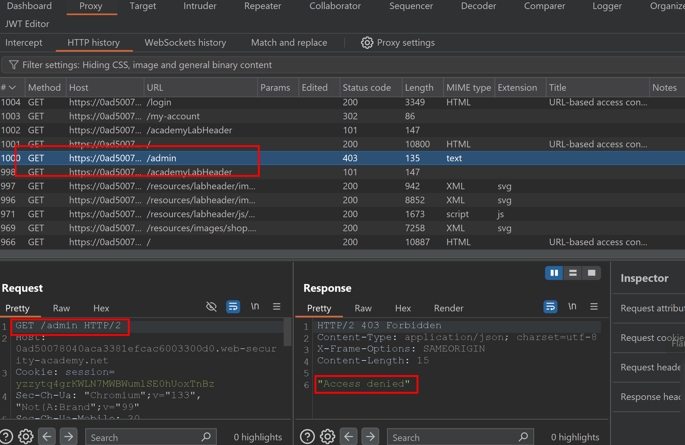
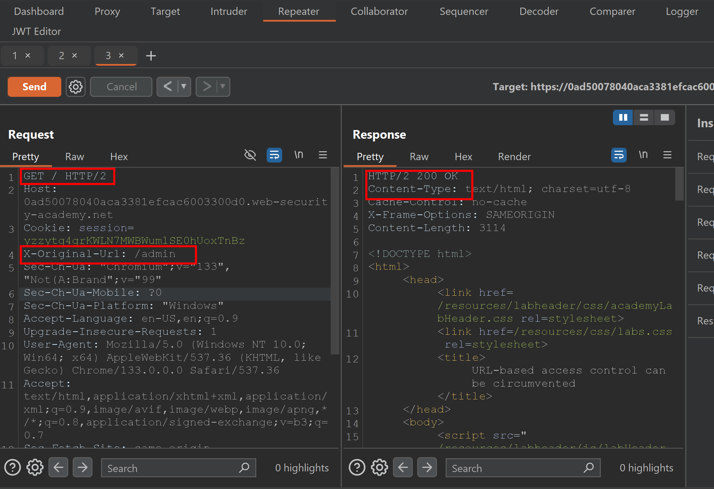
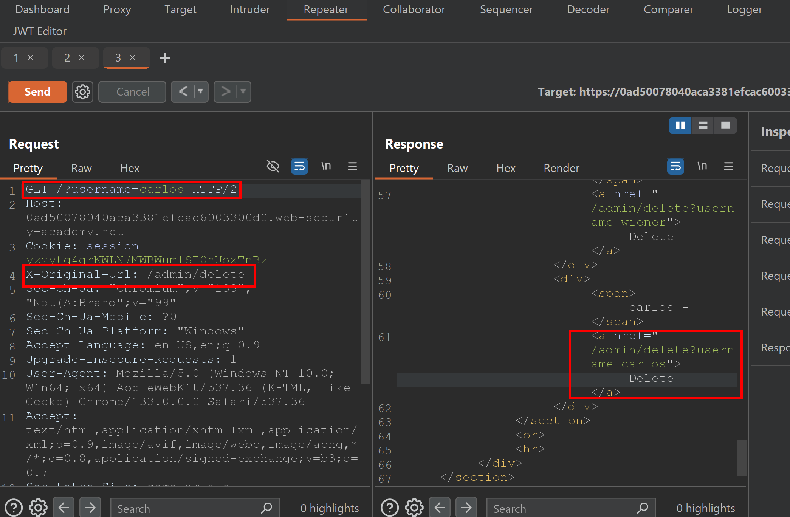
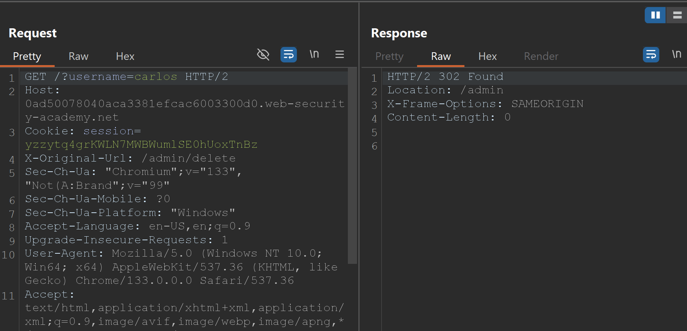
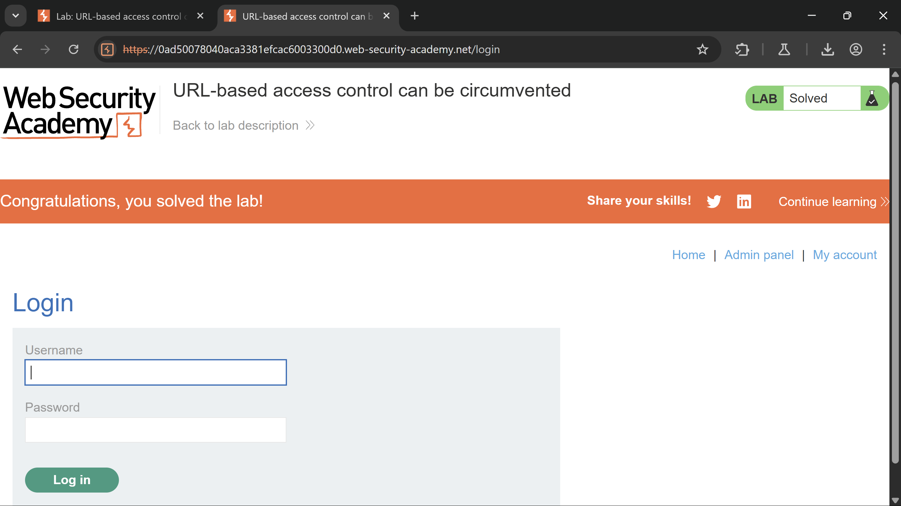

# **Access control vulnerabilities** Labs

## **Lab - 1: Unprotected admin functionality**

This lab is very simple because the developer applied no protection. To solve this lab, I navigated to the robots.txt file and found the path to the admin panel, where I deleted the user Carlos.

## **Lab - 2: Unprotected admin functionality with unpredictable URL**

This lab features an unprotected admin panel, which can be found at a location that is not immediately obvious. However, the path to the admin panel is disclosed somewhere within the application.

To solve this lab, I simply checked the page source and discovered the admin panel path in the JavaScript code.

## **Lab - 3: User role controlled by request parameter**

This lab has an admin panel located at /admin, which identifies administrators using a forgeable cookie.

I noticed that when I change the cookie value from **`Admin:False`** to **`Admin:True`**, it displays the admin panel button. To ensure all requests have the admin cookie value set to True, I utilized Burp’s Match and Replace feature. This feature automatically replaces the cookie value with True before sending requests to the server.

After gaining access to the admin panel, I deleted the user Carlos.

## **Lab - 4: User role can be modified in the user profile**

This lab features an admin panel located at /admin, which is accessible only to users who are logged in and have a role ID of 2.

To solve this lab, I began by capturing the request for changing the email. Then, I added `"roleid": 2` to the JSON post data alongside the email key. This modification granted me access to the admin panel.

## **Lab - 5: User ID controlled by request parameter**

This lab contains a horizontal privilege escalation vulnerability on the user account page.

To solve this lab, I logged in as Wiener and changed the value of the id parameter from "Wiener" to "Carlos." I obtained Carlos's API keys and submitted them.

## Lab - 6: **User ID controlled by request parameter, with unpredictable user IDs**

This lab has a horizontal privilege escalation vulnerability on the user account page, which identifies users using GUIDs.

I logged in as Wiener. In the browser's URL bar, I noticed an "id" parameter with an unintelligible value. I considered changing the "id" to log in as Carlos, but the "id" was not easily guessable. I navigated to the homepage and visited a blog page where Carlos had posted a blog. After going to Carlos's profile page, I obtained his "id." I then changed the "id" in my account page to Carlos's and logged in.

## Lab - 7: **User ID controlled by request parameter with data leakage in redirect**

This lab demonstrates an access control vulnerability, where sensitive information is exposed in the body of a redirect response.

To solve this lab, I logged in as Wiener. I noticed the "id" parameter in the browser's URL bar and changed it from "wiener" to "carlos." The page then redirected to the /login endpoint. I checked the request in Burp Suite and found that the 302 response was leaking data. I copied the API keys belonging to Carlos from this response and submitted them.

## Lab - 8: **User ID controlled by request parameter with password disclosure**

This lab features a user account page that displays the current user's existing password in a masked input field.

To solve this lab, I logged in as the user "wiener." On the "My Account" page, I noticed that the current password was masked, but still present, and the ID parameter was set to "wiener." I then changed the ID parameter to "administrator." After this change, the account page displayed the masked password for the administrator account. I used the browser's "Inspect Element" feature to view the password clearly.

## **Lab - 9: Insecure direct object references**

This lab stores user chat logs directly on the server's file system and retrieves them using static URLs.

To solve this lab, I first noticed the live chat feature on the homepage. Then, I navigated to the live chat page, where anyone can interact with the helpline bot. I also saw an option to view the transcript. After clicking the button, a file named transcript 2.txt was downloaded. I checked the request in Burp Suite and changed "2.txt" to "1.txt." This allowed me to access another user's chat with the helpline, and I discovered one user's password. I then went to the account page, tried the username "carlos" with the retrieved password, and successfully logged in as Carlos.

## Lab - 10: **URL-based access control can be circumvented**

The website has an unauthenticated admin panel located at `/admin`, but a front-end system has been configured to block external access to this path. However, the back-end application is built on a framework that supports the `X-Original-URL` header.

After realising that the front-end doesn’t allow direct access to the `/admin` endpoint, and that the back-end uses the `X-Original-URL` header to overwrite the URL, I first captured the request in Burp Suite.

Next, I went to the Repeater tab and modified the request to test whether the `X-Original-URL` header was functioning. I changed the request to target the `/`endpoint, added the `X-Original-URL` header, and set it to `/admin`. To my surprise, I received a 200 OK response, indicating that it was working.

I then created a request to delete the user `"Carlos"` in order to solve this lab and sent the request. The server returned a **302 response**, confirming that the Carlos user had been deleted

The lab task has been completed.

## Lab - 11: **Method-based access control can be circumvented**

This lab implements access controls based partly on the HTTP method of requests. You can familiarise yourself with the admin panel by logging in with the credentials: username - "**administrator**" and password - "**admin**."

To solve this lab, I first logged in as the admin and explored the admin page, where the admin can upgrade any user to give them admin access. I captured the request and initially tried changing the session cookie to that of a normal user, but I received an "**Unauthorised**" response. Next, I changed the request method from **POST** to **GET** and added the session cookie for the user "**wiener**." This allowed the user "**wiener**" to gain admin access.

The vulnerability in this scenario is that any user can obtain admin privileges simply by changing the request method of the **`/admin_roles`** request.

## Lab - 12: **Multi-step process with no access control on one step**

This lab features an admin panel with a flawed multi-step process for changing a user's role. You can explore the admin panel by logging in with the credentials: **`administrator: admin`**.

This lab is somewhat similar to previous labs; however, the key difference is that the admin must confirm any changes before granting a user admin access. The second request, which requires confirmation, lacks proper access control implementation. Therefore, I simply copied Wiener’s session cookie, modified it in the **`/admin-roles`** request, and submitted the request. As a result, Wiener was granted admin access.

## Lab - 13: **Referer-based access control**

This lab controls access to certain administrative functionality based on the Referer header. You can familiarise yourself with the admin panel by logging in using the credentials: username "**administrator**" and **password** "admin."

The lab is similar to previous ones in that the developer has implemented access control, but it only checks the `Referer`header to determine the origin of the request. Any user can modify the **Referer** header to include "**`/admin`**," causing the server to mistakenly believe that the request came from an admin. By doing this, Wiener was able to gain admin access.