# JWT

JWTs (JSON Web Tokens) are most commonly used in authentication, session management, and access control mechanisms.

The **header and payload parts** of a JWT are just **base64url-encoded JSON objects**. The header contains metadata about the token itself, while the payload contains the actual "claims" about the user.

A JWT is usually either a **JWS (JSON Web Signature) or JWE (Encryption) token**.

# **JWT attacks**

JWT attacks involve a user sending modified JWTs to the server in order to achieve a malicious goal. Typically, this goal is to **bypass authentication and access controls** by impersonating another user who has already been authenticated.

# **Exploiting flawed JWT signature verification**

## **1. Accepting arbitrary signatures**

**LAB —> [JWT authentication bypass via unverified signature](https://portswigger.net/web-security/jwt/lab-jwt-authentication-bypass-via-unverified-signature)**

In this lab, the server doesn’t verify the signature, which is why only changing the username is enough to do this attack. 

## 2. **Accepting tokens with no signature**

**LAB —> [JWT authentication bypass via flawed signature verification](https://portswigger.net/web-security/jwt/lab-jwt-authentication-bypass-via-flawed-signature-verification)**

In this lab, if we set the **algo parameter** to **`none`**, then the server doesn’t check the signature.

# **Brute-forcing secret keys**

In this type, if the developer used the HS256 algorithm, which only checks the key of the string value

we can easily brute force it by using the wordlist. 

**Wordlist** **—>** https://github.com/wallarm/jwt-secrets/blob/master/jwt.secrets.list

## **Brute-forcing secret keys using hashcat**

**Command —> `hashcat -a 0 -m 16500 <jwt> <wordlist>`**

**LAB —> [JWT authentication bypass via weak signing key](https://portswigger.net/web-security/jwt/lab-jwt-authentication-bypass-via-weak-signing-key)**

In this lab, we use the wordlist to brute force the key using hashcat. after that modified the JWT.

# **JWT header parameter injections**

- `jwk` (JSON Web Key) - Provides an embedded JSON object representing the key.
- `jku` (JSON Web Key Set URL) - Provides a URL from which servers can fetch a set of keys containing the correct key.
- `kid` (Key ID) - Provides an ID that servers can use to identify the correct key in cases where there are multiple keys to choose from. Depending on the format of the key, this may have a matching `kid` parameter.

## **1. Injecting self-signed JWTs via the `jwk` parameter**

**LAB —> [JWT authentication bypass via jwk header injection](https://portswigger.net/web-security/jwt/lab-jwt-authentication-bypass-via-jwk-header-injection)**

### **JWK**

A JWK (JSON Web Key) is a standardised format for representing keys as a JSON object.

- Misconfigured servers sometimes use any key that's embedded in the `jwk` parameter.

**Steps to use while injecting JWK:-**

1. With the extension loaded, in Burp's main tab bar, go to the **JWT Editor Keys** tab.
2. [Generate a new RSA key.](https://portswigger.net/burp/documentation/desktop/testing-workflow/session-management/jwts#adding-a-jwt-signing-key)
3. Send a request containing a JWT to Burp Repeater.
4. In the message editor, switch to the extension-generated **JSON Web Token** tab and [modify](https://portswigger.net/burp/documentation/desktop/testing-workflow/session-management/jwts#editing-jwts) the token's payload however you like.
5. Click **Attack**, then select **Embedded JWK**. When prompted, select your newly generated RSA key.
6. Send the request to test how the server responds.

## 2. **Injecting self-signed JWTs via the jku parameter**

**LAB —> [JWT authentication bypass via jku header injection](https://portswigger.net/web-security/jwt/lab-jwt-authentication-bypass-via-jku-header-injection)**

Instead of embedding public keys directly using the `jwk` header parameter, some servers let you use the `jku` (JWK Set URL) header parameter to reference a JWK Set containing the key. When verifying the signature, the server fetches the relevant key from this URL.

- JWK Sets (**Means an array of keys**) like this are sometimes exposed publicly via a standard endpoint, such as `/.well-known/jwks.json`.

**`Steps:`**

1. First, create a new RSA key by using the JWT editor extension and copy it as a JWK.
2. Go to the exploit server and paste the key in the format below:
    
    ```bash
    {
    "keys": [
    <paste the key here>
    ]
    }
    ```
    
3. and copy the value of kid.
4. Now, on the repeater tab, click on JSON web token extension and replace the kid value with the earlier copied value.
5. Change the sub parameter value to administrator.
6. Sign with the generated key.
7. Send the request to test the server’s response.

## 3. **Injecting self-signed JWTs via the kid parameter**

**LAB —> [JWT authentication bypass via kid header path traversal](https://portswigger.net/web-security/jwt/lab-jwt-authentication-bypass-via-kid-header-path-traversal)**

**`Steps:`**

1. First, go and create a new key and set the value of the k parameter to **`AA==`**  (base64 encoded null byte).
2. Now, go to JSON web token extension and change the value of the kid parameter to **`../../../dev/null`**
3. Sign with the keys generated.
4. Send the request to test the server’s response.

# **JWT algorithm confusion**

**Lab: JWT authentication bypass via algorithm confusion**

**`Steps:`**

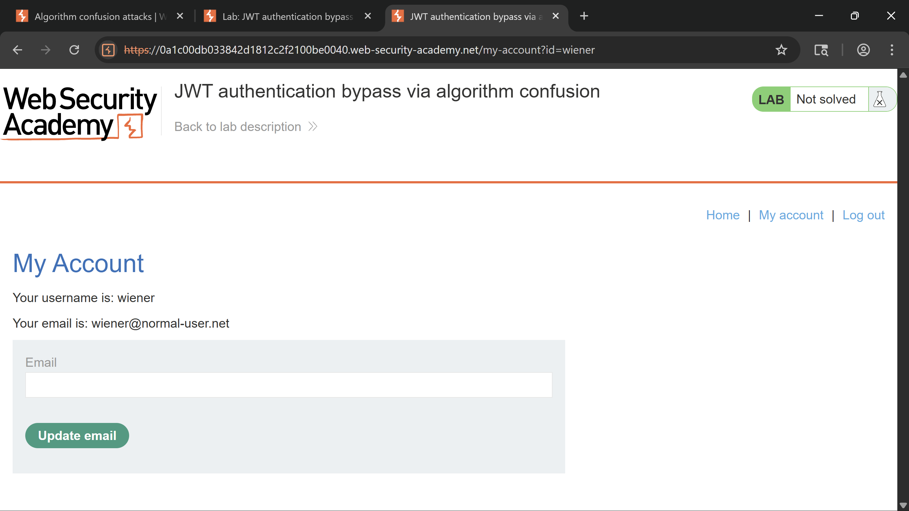

1. First, go to the `jwks.json` endpoint and copy the **jwk**.

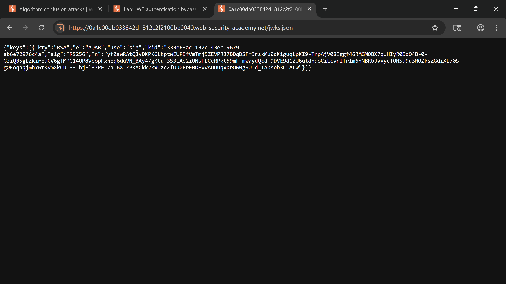

2. Now go to the JWT editor extension and click on generate new RSA, paste the content you copied and click ok.

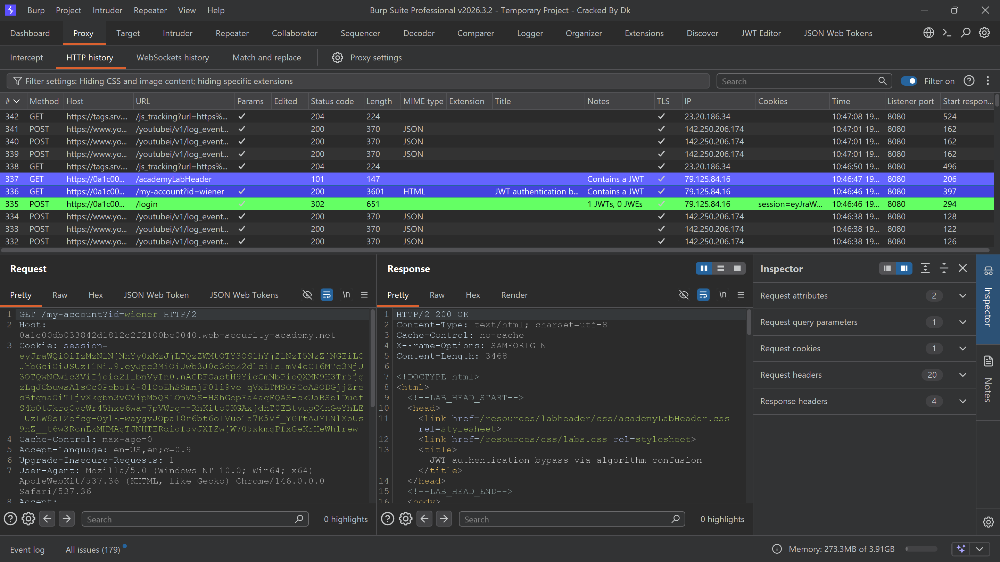

3. Right-click it and copy as PEM and base64 encode it. (If it does not convert to PEM format, then use an online converter like [https://8gwifi.org/jwkconvertfunctions.jsp](https://8gwifi.org/jwkconvertfunctions.jsp) )

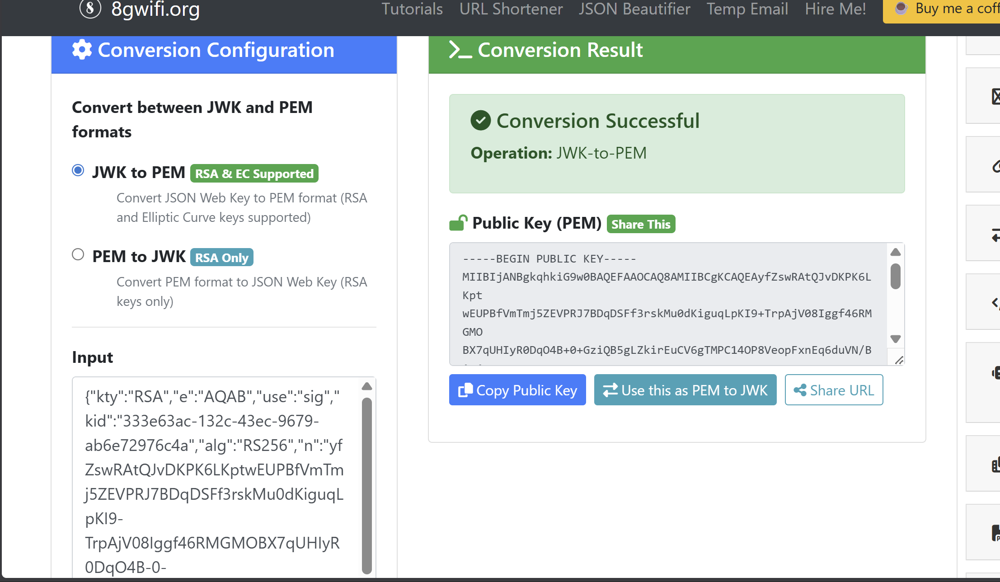

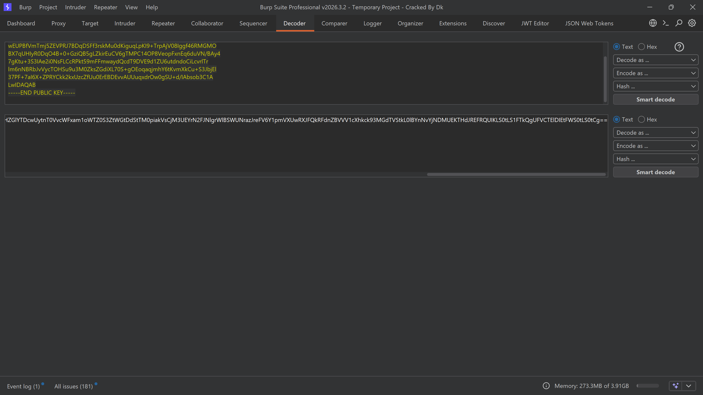

4. Go again to the JWT editor extension and now click on generate symmetric key and replace the value of the k parameter with the copied base64 string.

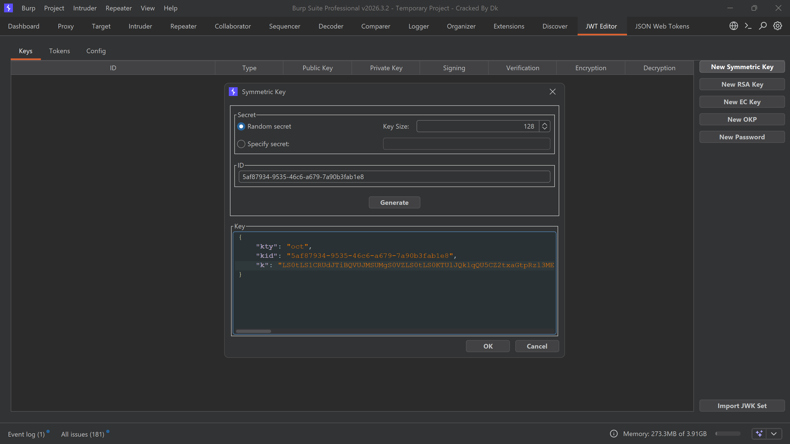

5. Go to JSON web token extension and change the alg parameter to HS256 and the sub to administrator.

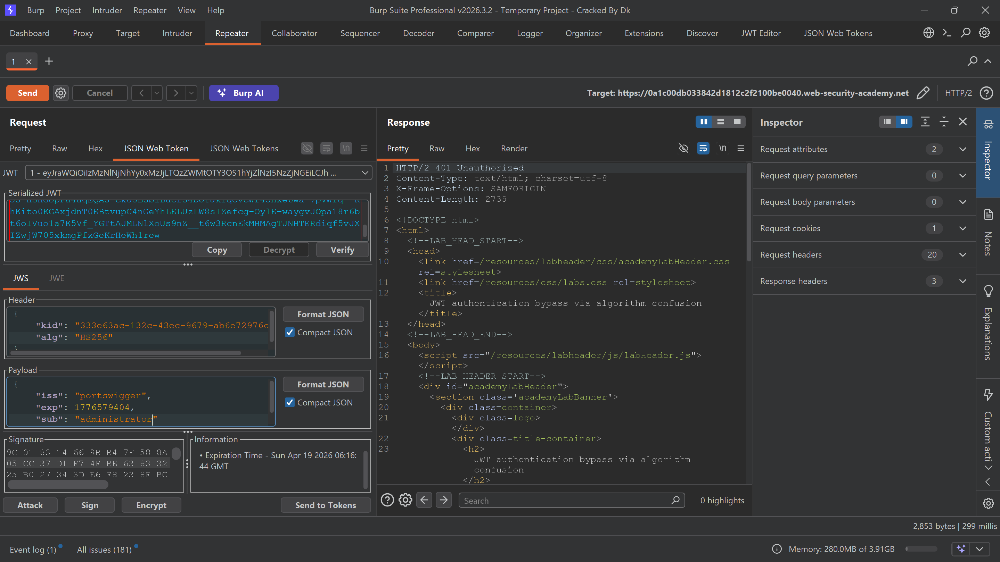

6. Now sign it.


7. Send the request to test the server’s response.


---

**Lab: JWT authentication bypass via algorithm confusion with no exposed key**

**`Steps:`**

1. To solve this lab, I have derived a key using a pair of existing JWTs.
2. First, go to your Linux terminal and run this command: **`docker run --rm -it portswigger/sig2n <token1> <token2>`**
3. Log in and copy token 1, and then log out and log in again with the same username and password and copy token 2.
4. Now just run the Docker command, and it will result in multiple forge JWT tokens.

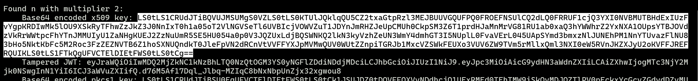

5. Now, replace tokens one by one and whichever result 200ok that will work.

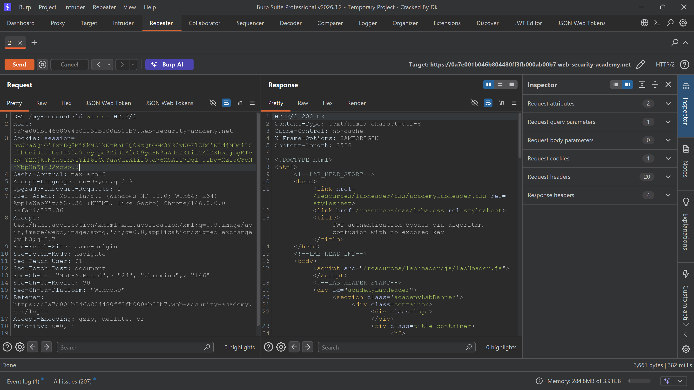

6. Go to the JWT Editor extension, generate a symmetric key, and replace the value of parameter k with the base64-encoded value of the working key you will have in the result.

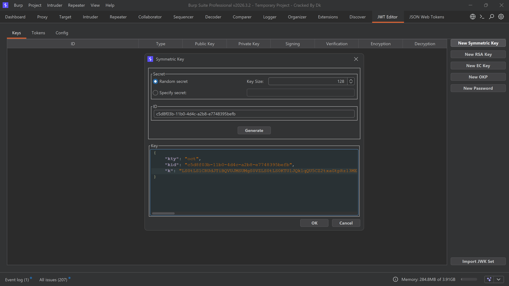

7. Make the necessary changes, like changing alg to HS256 and sub to administrator.
8. Sign it and send the request to test the server’s response.

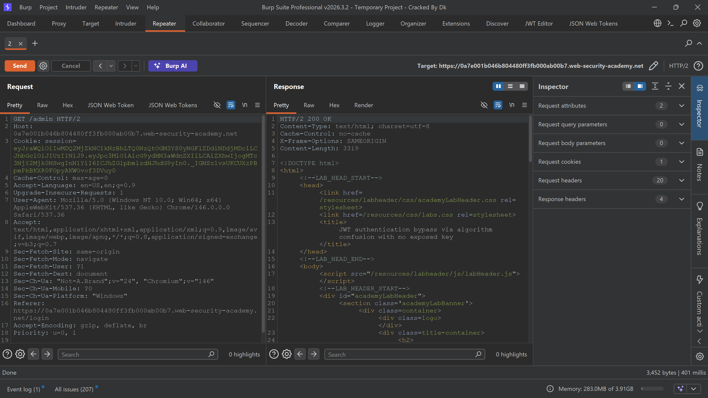

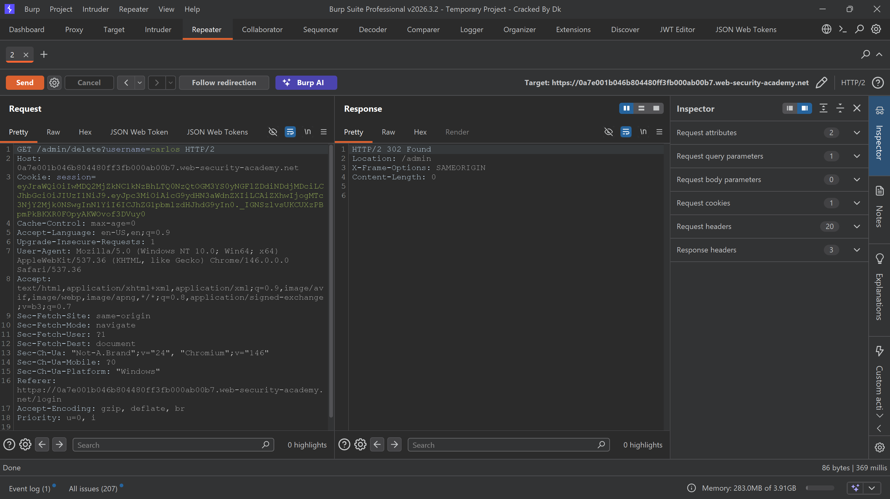

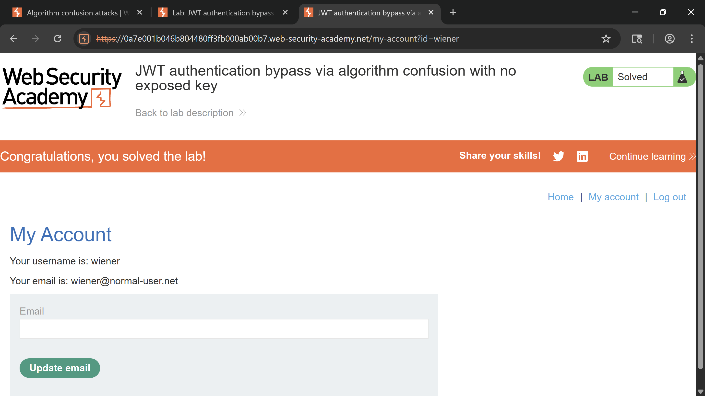